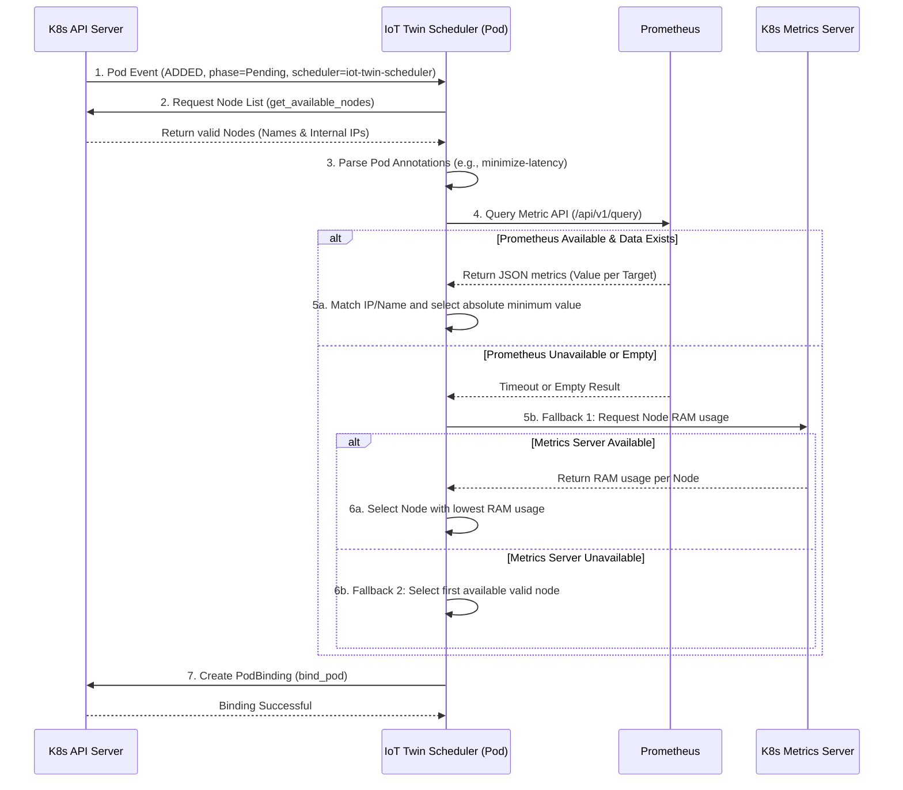

# 3. Proof of Concept (PoC): Telemetry-Driven Scheduling

### 3.1 Deployment Architecture

From an infrastructural perspective, the custom scheduler is designed as a fully cloud-native component rather than an external standalone script. Developed in Python, the application is containerized via Docker and deployed directly within the Kubernetes cluster as a standard `Deployment` (typically within the `kube-system` namespace).

By leveraging an `in-cluster` configuration and a dedicated ServiceAccount bound to specific RBAC (Role-Based Access Control) permissions, the containerized scheduler securely authenticates with the Kubernetes API server. This architectural choice ensures that the custom scheduler operates autonomously and securely as a secondary control plane component, running seamlessly alongside the default `kube-scheduler`.

### 3.2 PoC Evolution and Objectives

The development of the custom orchestrator began with an iterative Proof of Concept (PoC). Initially, the controller was designed as a simple Kubernetes API listener, capable only of identifying unassigned Pods and placing them on nodes sequentially. As the architecture evolved, the Prometheus monitoring stack was integrated to supply real-time telemetry data, transforming the script into a fully functional, context-aware scheduling engine.

This PoC successfully validated the core hypothesis: it is possible to bypass the static constraints of the default Kubernetes scheduler and dynamically route Digital Twins based on external physical conditions, while maintaining system stability through graceful degradation.

### 3.3 System Data Flow

The following sequence diagram illustrates the lifecycle of a scheduling event within the PoC architecture, from the interception of a pending Pod to its final node assignment.

### 3.4 Core Components and Code Analysis

The PoC is implemented in Python, leveraging the official `kubernetes` client library and the `requests` library for HTTP interactions with Prometheus. The codebase is modularized into specific functional blocks.

#### 1. Initialization and Event Loop (`main`)

The entry point configures the K8s client based on the execution environment (primarily `load_incluster_config()` since it runs as a Pod). It utilizes the `watch.Watch().stream()` method to continuously listen to the Kubernetes API for Pod events across all namespaces. The scheduler strictly filters these events, acting only when a Pod's status phase is `Pending` and its `spec.schedulerName` explicitly matches `iot-twin-scheduler`.

#### 2. Node Filtering and IP Mapping (`get_available_nodes`)

Before any metrics are evaluated, the system must identify valid target nodes. This function performs a rigorous filtering process:

* **Health Check:** It verifies that the node has a `Ready` status condition.
* **Taint Evaluation (Control Plane Protection):** It checks the node's `spec.taints` and actively discards any node bearing a `NoSchedule` effect, effectively protecting the Kubernetes Control Plane from being burdened with user workloads.
* **The Translation Layer:** To resolve the discrepancy between Kubernetes naming conventions (hostnames) and Prometheus exporter labels (often IP addresses), the function extracts the `InternalIP` of every valid node. It returns a mapping dictionary (`{'node_name': 'internal_ip'}`), heavily fortifying the cross-referencing logic used later.

#### 3. Telemetry Integration (`get_prometheus_metric`)

This function handles the synchronous HTTP GET requests to the Prometheus API (`/api/v1/query`). It includes a strict 3-second timeout to prevent the scheduler from hanging during network partitions. Upon receiving the JSON payload, it parses the data array, capturing identifying labels (`kubernetes_node` or `instance`). It strips any port numbers from the strings (e.g., converting `192.168.0.61:9100` to `192.168.0.61`) to ensure clean mapping against the dictionary generated in the node filtering phase.

#### 4. The Decision Engine (`calculate_best_node`)

This block serves as the brain of the PoC. It extracts the `iot-scheduler/strategy` annotation from the Pod metadata.

* Depending on the requested strategy (`minimize-latency`, `temperature-aware`, or `disk-io-aware`), it formulates a specific PromQL query targeting the relevant exporter (Blackbox or Node Exporter).
* It cross-references the Prometheus results against both the Node Name and the Node IP.
* Because the primary objective in these IoT scenarios is minimization (lowest latency, coolest node, least busy disk), the algorithm iterates through the valid nodes to find the absolute minimum metric value, declaring that node the winner.

#### 5. Graceful Degradation (`fallback_metrics_server`)

Distributed Edge systems are prone to partial failures. If the Prometheus query times out, or if the underlying hardware does not export a requested metric (e.g., thermal sensors on virtual machines), the PoC initiates a safety fallback mechanism. It queries the native K8s Metrics Server (`metrics.k8s.io`) via the `CustomObjectsApi`. It retrieves the current memory usage of all valid nodes, sanitizes the capacity strings (stripping "Ki" units), and routes the Pod to the node with the highest available memory. If the Metrics Server is also unreachable, it defaults to placing the Pod on the first available node in the list.

#### 6. Pod Binding (`bind_pod`)

The final step is translating the algorithmic decision into a cluster state change. The function creates a `V1Binding` object targeting the winning node and sends it to the API server. This function includes a specific `except ValueError` catch-block designed to handle a known bug within the Kubernetes Python client, where a successfully executed binding operation occasionally fails to deserialize the API response properly.

---